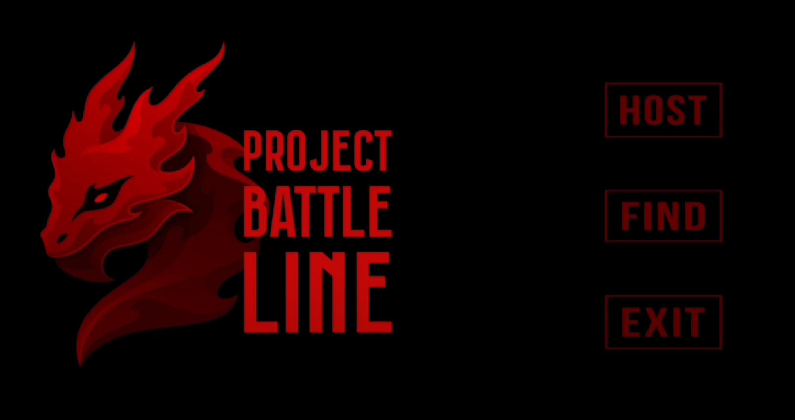
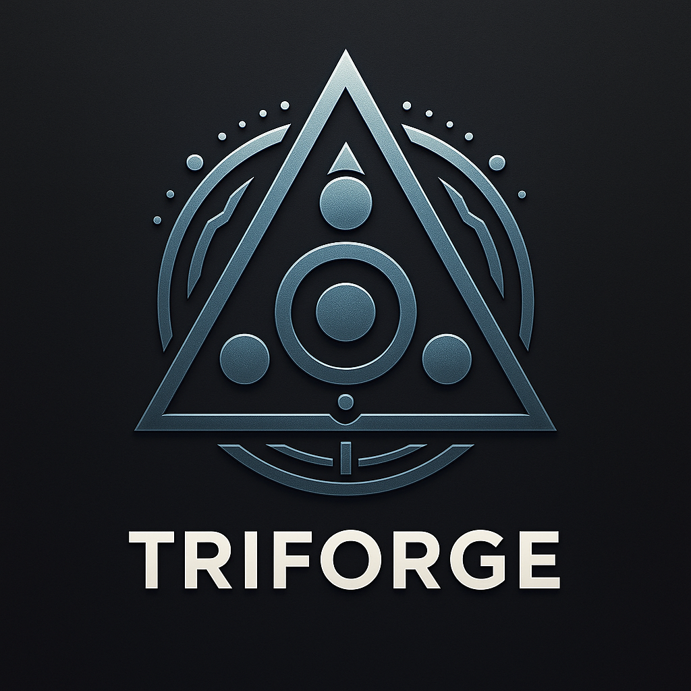
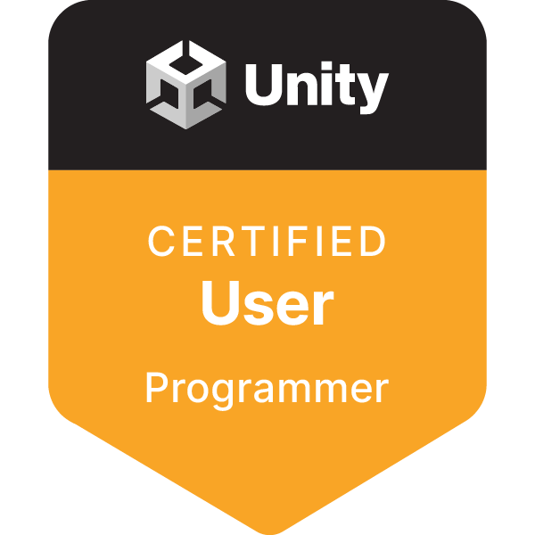

# 👋 소개 (About Me) 
### 최태영 | Unreal Client Developer

언리얼 엔진 게임 클라이언트에 관심이 많은   
경상국립대 4학년 학부생 프로그래머입니다.   
어릴 때부터 장르를 가리지 않고 게임을 즐겨왔으며,    
이를 통해 장르를 불문하고 다양한 도전을 하고픈 게임 개발자 지망생입니다!   

아래는 주요 프로젝트 목록과 제 역할 중심 요약입니다.

## 🛠️ 기술스택 (Skills)
- 언어 : C++, Blueprints
- 엔진 : Unreal Engine 5, Unity
- 툴 : Git, Rider, Visual Studio 2022
- 백엔드/API : AWS GameLift, Cognito 등

## 📁 프로젝트 (Projects)

### [🕹️ Project_PBL](./Project_PBL/)
<a href="https://youtu.be/-3ciZHhTgDc">
- 간단 소개 : Unreal Engine 기반 TPS 장르 보스레이드
- 개발 인원 : 5명
- 맡은 역할 : 보스 몬스터 구현, AI 행동 트리 설계 등

### [🛡️ Project_TriForge](./Project_TriForge/)

<a href="https://youtu.be/lo1SQH9PyY0">
- 간단 소개 : 3D 액션 게임
- 개발 인원 : 3명
- 맡은 역할 : AWS server 관리, 네트워크 관리, 진행 규칙 관리, UI 등

## 📌 자격증 / 수상 (Certifications / Awards)

### Unity Certified User: Programmer
<a href="https://www.credly.com/badges/66087beb-5e31-41a6-aa80-5e04aa4ca27e/public_url">
- 2023.11 / Unity Technologies

### 경상국립대학교 2024 2학기 캡스톤디자인 경진대회
(사진첨부/링크첨부)   
- 2024.12 / 경상국립대학교 산학연협력선도대학육성사업단(LINC 3.0)

---

## 📬 연락처

- Email: cutwoplus@naver.com
- GitHub: [github.com/choiguri](https://github.com/choiguri)
